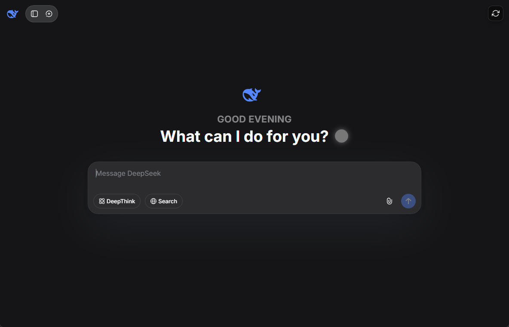

# 🚀 DeepSeek Desktop 桌面版 🚀

Hello there! ( ´ ∀ ` )ﾉ Welcome to the DeepSeek Desktop project! We're super excited to have you here. This project is a labor of love, and we're constantly working to make it even better. If you have any cool ideas or find any pesky bugs, please let us know in the [issues](https://github.com/LousyBook94/DeepSeek-Desktop/issues) section! We'd love to hear from you! ♡



## 📦 Installation 📦

Getting started is as easy as 1-2-3! Just follow these simple steps:

1.  Head over to the [Releases page](https.github.com/LousyBook94/DeepSeek-Desktop/releases).
2.  Download the `DeepSeekChat-windows.zip` file.
3.  Extract the zip file to a cozy little spot on your computer.
4.  Run `DeepSeekChat.exe` to launch the app!
5.  Don't forget to run `auto-update.bat` to keep the app fresh and updated with the latest features! ✨

## ✨ Features ✨

We've packed this desktop app with a bunch of cool features to make your DeepSeek chat experience absolutely amazing! (ﾉ◕ヮ◕)ﾉ*:･ﾟ✧

-   🎨 **Custom UI Elements**: We've added some personal touches, like custom footer text and the sleek "Inter" font throughout the interface.
-   ⏰ **Dynamic Greetings**: Get a warm welcome with time-based greetings (Good Morning, Good Afternoon, and Good Evening) that gently fade in and out.
-   ✨ **Cute Animations**: Enjoy a fun typing animation with a sphere cursor and a self-healing UI that magically fixes itself!
-   🧹 **A Super Clean Interface**: We've tidied up the place and removed unnecessary clutter for a more focused chat experience.
-   🌙 **Dark Titlebar Support**: The titlebar automatically matches your Windows system theme. You can also manually set it to dark or light mode!
-   🔃 **Auto Updater**: Keep your app up-to-date effortlessly!
-   🔄 **Real-time Synchronization**:
    -   A beautiful frosted glass refresh button that hides away when you don't need it.
    -   Your navigation state is saved on refresh, so you'll never lose your spot.
    -   Smooth loading indicators and a refresh popup to keep you in the loop.
    -   A helpful welcome tooltip for new users.
-   📝 **Enhanced Markdown Rendering**:
    -   Enjoy full markdown rendering in your messages.
    -   Code blocks that automagically match your system's light or dark theme.
    -   The stylish "JetBrains Mono" font for easy-to-read code.
    -   Stay safe with DOMPurify, which prevents XSS attacks.
    -   We've fixed those annoying spacing issues for a polished look.
    -   Proper handling of code blocks and inline code.

## 🛠️ Advanced Usage 🛠️

For all you power users out there, here are some cool tricks you can do:

```bash
# Force a dark titlebar, no matter what your system theme is!
DeepSeekChat.exe --dark-titlebar

# Force a light titlebar, because you can!
DeepSeekChat.exe --light-titlebar

# Run in release mode (disables debug tools)
DeepSeekChat.exe --release
```

By default, the titlebar will match your Windows theme. So if you're a creature of the night with a dark theme, the titlebar will be dark too! 🌃 If you prefer the light side, it'll be light. ☀️

## 🔮 Future Plans 🔮

We're always dreaming up new ideas! Here's what we have in mind for the future:

-   [x] ~~Dark titlebar support~~ ✅ **Done and done!**
-   [ ] Custom theme support for the whole interface. Let's get creative! 🎨
-   [ ] Keyboard shortcuts to make you a chat ninja! 🥷
-   [ ] Cross-platform builds for our Mac and Linux friends. 🍎🐧
-   [ ] System tray integration for easy access.

## 👋 Connect with Me 👋

Come say hi! I'd love to connect with you.

-   [YouTube](https://youtube.com/@LousyBook01)
-   [GitHub](https://github.com/LousyBook94)

## 😎 Cool Guys 😎

These are the amazing people who have helped make this project awesome!

-   [vanja-san](https://github.com/vanja-san)
-   Jules (Hey, that's me! I'm helping out! 👋)

## 🙏 Attribution 🙏

We couldn't have done it without these amazing resources:

-   Icons by [Icons8](https://icons8.com)
-   Powered by the magic of [DeepSeek](https://deepseek.com)
