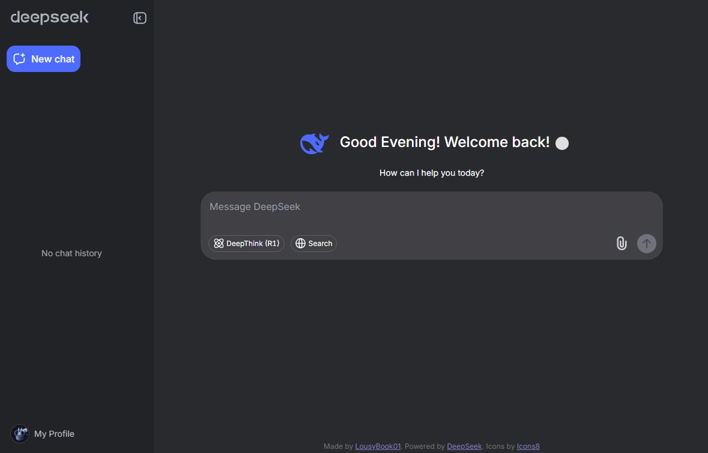

## 🚀 DeepSeek Desktop

> Your ultimate desktop companion for DeepSeek Chat — now smoother, prettier, and packed with magic ✨

**⚠️ Note:** This project is still under active development. Expect more crazy features soon!
Bugs or suggestions? Drop them in [issues](https://github.com/LousyBook94/DeepSeek-Desktop/issues) 💀🔥



---

## 💾 Installation

1. Head to the [Releases page](https://github.com/LousyBook94/DeepSeek-Desktop/releases)
2. Download `DeepSeekChat-windows.zip`
3. Extract the files
4. Run `DeepSeekChat.exe`
5. Run `auto-update.bat` to keep your app fresh 🚀

---

## ✨ Features

**DeepSeek Desktop** comes loaded with enhancements to make your chat experience 💯:

* 🎨 **Custom UI Elements**

  * Custom footer text
  * Forced **Inter font** throughout

* ⏰ **Dynamic Greetings**

  * Good Morning/Afternoon/Evening messages
  * Smooth fade transitions

* ✨ **Animations**

  * Typing animation with sphere cursor
  * Self-healing UI via MutationObservers

* 🧹 **Clean Interface**

  * Removed cluttered UI elements
  * Persistent styling across navigation

* 🌙 **Dark Titlebar Support**

  * Matches your Windows system theme automatically
  * Manual override available

* 🔃 **Auto Updater**

* 🔄 **Real-time Sync & Navigation**

  * Frosted glass refresh button with auto-hide
  * URL path preserved on refresh
  * Smooth loading indicators & popups
  * Welcome tooltip for first-time guidance

* 📝 **Enhanced Markdown Rendering**

  * Full markdown support in messages
  * System theme detection for code blocks
  * JetBrains Mono for code readability
  * XSS protection via DOMPurify
  * Proper spacing & inline code handling

---

## 🔧 Advanced Usage

```bash
# Force dark titlebar
DeepSeekChat.exe --dark-titlebar

# Force light titlebar
DeepSeekChat.exe --light-titlebar

# Run in release mode (disable debug tools)
DeepSeekChat.exe --release
```

By default, the titlebar **matches your Windows theme** automatically 🌙☀️

---

## 🔮 Future Plans

* [x] Dark titlebar ✅
* [ ] Custom themes
* [ ] Keyboard shortcuts
* [ ] Cross-platform builds (Mac/Linux)
* [ ] System tray integration

---

## 👋 Connect with Me

* [YouTube](https://youtube.com/@LousyBook01)
* [GitHub](https://github.com/LousyBook94)

---

## 🤘 Cool Contributors

<!-- readme: collaborators,contributors -start -->
<table>
	<tbody>
		<tr>
            <td align="center">
                <a href="https://github.com/vanja-san">
                    
                    <br />
                    <sub><b>Ioann</b></sub>
                </a>
            </td>
            <td align="center">
                <a href="https://github.com/LousyBook94">
                    
                    <br />
                    <sub><b>LousyBook 01</b></sub>
                </a>
            </td>
            <td align="center">
                <a href="https://github.com/dwip-the-dev">
                    
                    <br />
                    <sub><b>Dwip Biswas </b></sub>
                </a>
            </td>
		</tr>
	<tbody>
</table>
<!-- readme: collaborators,contributors -end -->

## 🔧Bots that help the project

<!-- readme: bots -start -->
<table>
	<tbody>
		<tr>
            <td align="center">
                <a href="https://github.com/mentatbot[bot]">
                    
                    <br />
                    <sub><b>mentatbot[bot]</b></sub>
                </a>
            </td>
            <td align="center">
                <a href="https://github.com/github-actions[bot]">
                    
                    <br />
                    <sub><b>github-actions[bot]</b></sub>
                </a>
            </td>
            <td align="center">
                <a href="https://github.com/google-labs-jules[bot]">
                    
                    <br />
                    <sub><b>google-labs-jules[bot]</b></sub>
                </a>
            </td>
		</tr>
	<tbody>
</table>
<!-- readme: bots -end -->

---

## ⚡ Attribution

* Icons by [Icons8](https://icons8.com)
* Powered by [DeepSeek](https://deepseek.com)

